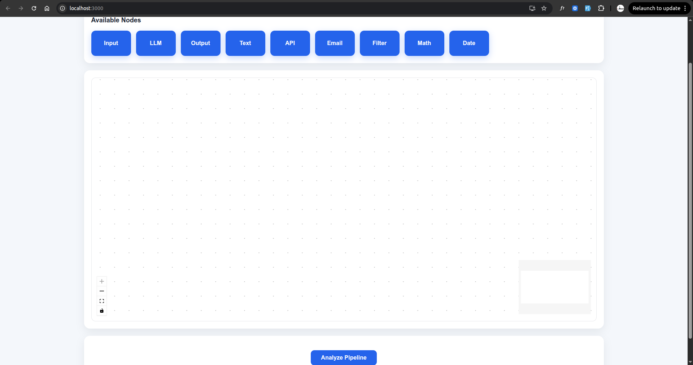
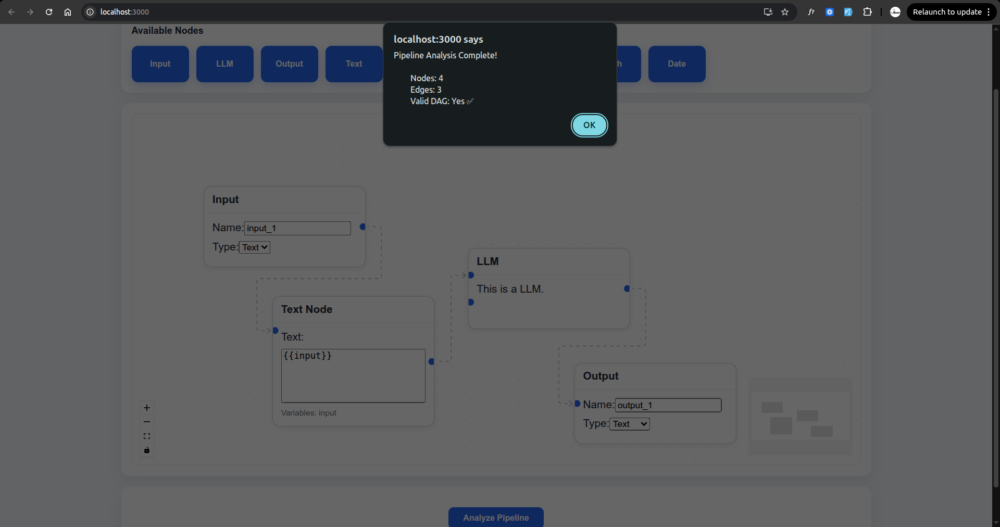

# Pipeline Builder

A React and FastAPI application for building and analyzing visual workflow pipelines.

This project was completed as part of the VectorShift Frontend Technical Assessment. It demonstrates reusable component architecture, dynamic node generation, backend integration, and graph validation.

---

## Preview





## Features

- Drag-and-drop pipeline editor using React Flow
- Reusable node abstraction through a shared `BaseNode` component
- Five additional custom node types demonstrating extensibility
- Dynamic Text Node that:
  - Automatically resizes with content
  - Detects variables using `{{variable}}` syntax
  - Dynamically generates input handles

- Pipeline submission to a FastAPI backend
- Backend analysis returning:
  - Number of nodes
  - Number of edges
  - Whether the pipeline is a Directed Acyclic Graph (DAG)

- Improved and consistent user interface

---

## Tech Stack

### Frontend

- React
- React Flow
- Zustand

### Backend

- Python
- FastAPI

---

## Project Structure

```
.
├── frontend
│   ├── src
│   │   ├── nodes
│   │   ├── App.js
│   │   ├── store.js
│   │   ├── toolbar.js
│   │   ├── ui.js
│   │   └── submit.js
│   └── package.json
│
└── backend
    └── main.py
```

---

## Getting Started

### Clone the repository

```bash
git clone <repository-url>
```

### Frontend

```bash
cd frontend
npm install
npm start
```

The frontend runs on:

```
http://localhost:3000
```

---

### Backend

Create and activate a virtual environment if needed.

Install dependencies:

```bash
pip install fastapi uvicorn python-multipart
```

Run the server:

```bash
python -m uvicorn main:app --reload
```

The backend runs on:

```
http://127.0.0.1:8000
```

---

## How It Works

1. Drag nodes from the toolbar onto the canvas.
2. Connect nodes to build a workflow.
3. Add variables to the Text Node using the format:

```
{{input}}
{{username}}
{{customerEmail}}
```

4. Click **Analyze Pipeline**.
5. The frontend submits the pipeline to the backend.
6. The backend returns:
   - Total nodes
   - Total edges
   - DAG validation result

---

## Design Decisions

The project focuses on maintainability and extensibility.

A shared `BaseNode` component removes duplicated layout logic across node implementations, allowing new node types to be created with minimal code.

The Text Node dynamically parses variables using regular expressions and generates corresponding connection handles, keeping the interface synchronized with user input.

Pipeline validation is delegated to the backend, which performs graph analysis and determines whether the submitted workflow forms a valid Directed Acyclic Graph.

---

## Future Improvements

- Replace browser alerts with a custom modal
- Persist pipelines to storage
- Add automated frontend and backend tests
- Improve node customization
- Add TypeScript support
- Enhance visual themes and animations
